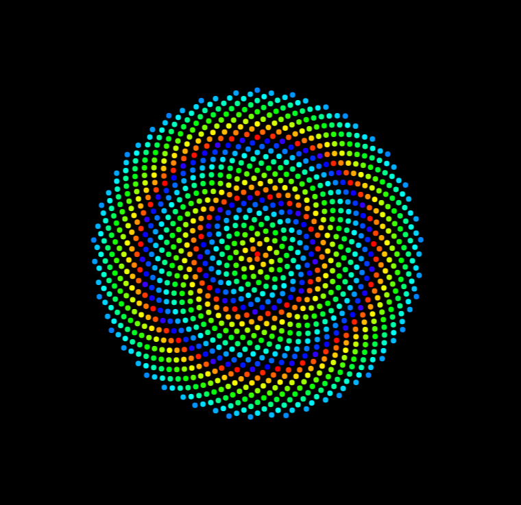

# Phyllotaxis Patterns

$\qquad$É um padrão produzido por plantas estudado tanto por biólogos quanto por matemáticos a fim de descrever o arranjo. 
$\qquad$Aqui o modelo apresentado é baseado no angulo de *Fibonacci* $\approx360.5°$, com isso e muitos outros estudos para este exemplo foi utilizado a seguinte formula:
$$\phi = n*137.75,\qquad r=c\sqrt{n}$$
<p align="center">

</p>

---
## Biblioteca utilizada

$\qquad$Para essa representação gráfica foi utilizado o framework **Flutter** com a biblioteca Flutter Processing. A seleção da linguagem foi devido ao interesse e necessidade de treinar a aplicar os conhecimentos adquiridos sobre a linguagem. 


## Lógica

```Dart
final n
//O loop é efeito para desenhar os pontos
for (int i = 0; i < n; i++) {
    final double angle = i * (137.5 / 360) * (2 * pi);
    final double radius = c * sqrt(i);
    //passando a coordenada polar para o plano cartesiano
    final double x = radius * cos(angle);
    final double y = radius * sin(angle);
```
O arquivo com o código pode ser acessado por este link: [main.dart](lib/main.dart)